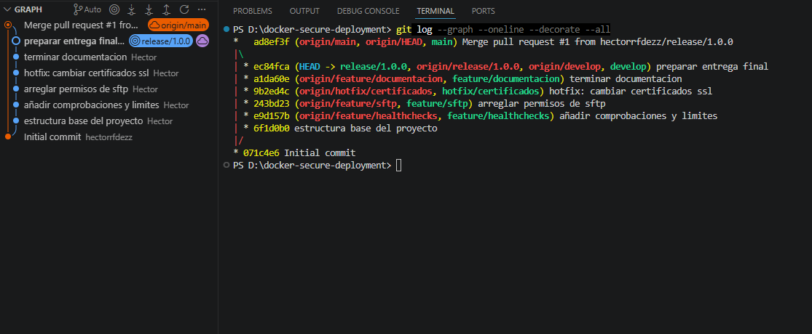

# docker-secure-deployment

Proyecto de despliegue seguro multi-tier con Docker Compose.  
Incluye frontend React, backend Java/Spring Boot, base de datos MySQL, proxy inverso Nginx y servicio SFTP para gestión de contenidos.

---

## Objetivo del proyecto

El objetivo es desplegar una aplicación web separada por capas, segura y administrable.  
La arquitectura evita accesos directos al backend, centraliza el tráfico externo en Nginx y aplica buenas prácticas como redes internas, usuarios no root, límites de recursos, healthchecks y gestión segura de permisos.

---

## Arquitectura

Servicios principales:

| Servicio | Función |
|---|---|
| `frontend` | Interfaz React de la aplicación. |
| `backend` | Servidor Java/Spring Boot con la API. |
| `db` | Base de datos MySQL con volumen persistente e inicialización mediante `init.sql`. |
| `nginx` | Proxy inverso, punto único de entrada, HTTPS y protección de rutas. |
| `sftp` | Servicio de subida segura de archivos al volumen compartido con Nginx. |

Nginx es el único servicio expuesto para el tráfico web.  
El backend y la base de datos quedan protegidos dentro de redes internas de Docker.

---

## Estructura del repositorio

```text
docker-secure-deployment/
├── backend/
├── certs/
├── db/
├── docs/
├── frontend/
├── nginx/
├── docker-compose.yml
├── .gitignore
└── README.md
```

---

## Medidas de seguridad aplicadas

- Nginx como único punto de entrada externo.
- Redirección automática de HTTP a HTTPS.
- Certificados autofirmados para el entorno de laboratorio.
- Ocultación de la versión de Nginx con `server_tokens off`.
- Páginas de error personalizadas para evitar firmas por defecto.
- Protección de `/admin` con Basic Auth.
- Rate limiting para reducir ataques de fuerza bruta.
- Backend sin puerto público expuesto.
- Redes separadas para frontend, backend y SFTP.
- Usuarios no root en los contenedores personalizados.
- Límites de CPU y memoria para backend y base de datos.
- Healthchecks para comprobar el estado de los servicios.
- SFTP con UID/GID alineado con Nginx, evitando usar `chmod 777`.

---

## Despliegue

Construir los contenedores:

```bash
docker compose build
```

Levantar el entorno:

```bash
docker compose up -d
```

Comprobar los servicios:

```bash
docker compose ps
```

Detener el entorno:

```bash
docker compose down
```

Eliminar también los volúmenes:

```bash
docker compose down -v
```

---

## Acceso a la aplicación

Aplicación web:

```text
https://localhost
```

Al usar certificados autofirmados, el navegador puede mostrar una advertencia de seguridad.  
Es normal en este entorno de pruebas.

Zona de administración:

```text
https://localhost/admin
```

Credenciales de laboratorio:

```text
Usuario: admin
Contraseña: admin123
```

---

## Acceso por SFTP

El servicio SFTP se expone en el puerto `2222`.

```bash
sftp -P 2222 sftpuser@localhost
```

Credenciales de laboratorio:

```text
Usuario: sftpuser
Contraseña: password
```

Los archivos subidos se guardan en el volumen compartido con Nginx y pueden servirse como contenido estático.

---

## Incidente de seguridad simulado

Se simuló una fuga de la clave privada TLS `server.key`.

Medidas tomadas:

1. Generación de nuevos certificados.
2. Sustitución de los archivos comprometidos.
3. Actualización de `.gitignore` para evitar subir claves privadas.
4. Documentación del incidente en `docs/critical_thinking.md`.
5. Resolución mediante una rama `hotfix/`.

---

## Git Flow

El proyecto se desarrolló siguiendo un flujo Git Flow con ramas:

```text
main
develop
feature/healthchecks
feature/sftp
feature/documentacion
hotfix/certificados
release/1.0.0
```

Comando usado para comprobar el historial:

```bash
git log --graph --oneline --decorate --all
```

Captura del historial Git Flow:

```markdown

```

---

## Documentación

La documentación técnica está en la carpeta `docs/`:

| Archivo | Contenido |
|---|---|
| `deployment_manual.md` | Instrucciones de despliegue. |
| `administration_manual.md` | Medidas de seguridad, hardening y recursos. |
| `critical_thinking.md` | Respuestas a los retos de seguridad. |
| `git_flow_report.md` | Evidencia del flujo Git utilizado. |

---

## Autor

Héctor  
Repositorio: `https://github.com/hectorrfdezz/docker-secure-deployment`
